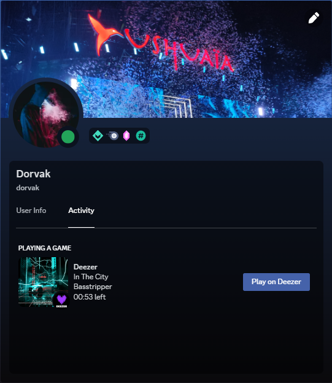

# DeezerRPC
> A simple Deezer Rich Presence Client for Discord.

## Installation
1. Download the latest release from [here](https://github.com/DorvakOff/DeezerRPC/releases/latest).
2. Extract the archive.
3. On Windows, run `DeezerRPC.exe`. On Linux, run `DeezerRPC`. And on macOS, run `DeezerRPC.app`.

## Usage
### Shortcuts (keyboard) / Taskbar buttons
- Play/Pause : Pause/Resume the current song.
- Next : Play the next song.
- Previous : Play the previous song.

### Settings (tray / notifications icon)
> Settings are available in the tray icon (located in the notification icons area)

Right click the tray icon to display the menu.

## Notes
- This application is not affiliated with Deezer or Discord.
- This work is based on [DeezerRPC by Braasileiro](https://github.com/Braasileiro/DeezerRPC)

### Data-Protection
> This application does not collect any data from you. The only data that is being sent is the data that is required for the Discord Rich Presence to work. This includes the song title, artist name, album name, album cover and the current time of the song. This data is only being sent to Discord and not to any other third-party service.
